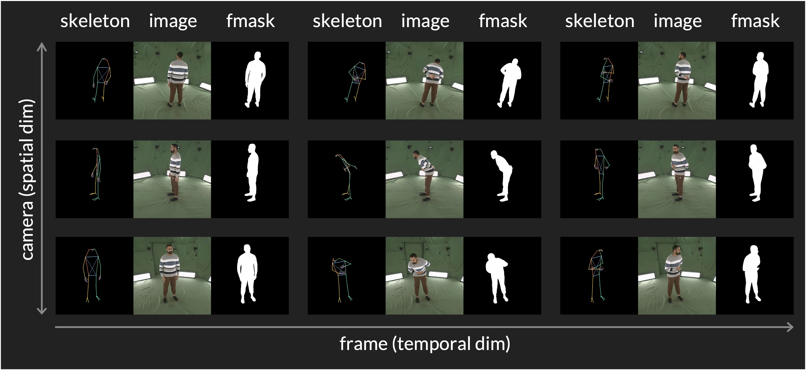

<h1 align="center">
  <a href="(https://diffuman4d.github.io/">
    </a>
</h1>

<p align="center">
  <a href="https://diffuman4d.github.io/"><strong>Project Page</strong></a>
  &nbsp;|&nbsp;
  <a href="https://arxiv.org/abs/2507.13344"><strong>Paper</strong></a>
</p>

> The official repo for "Diffuman4D: 4D Consistent Human View Synthesis from Sparse-View Videos with Spatio-Temporal Diffusion Models".


<p align="center">Diffuman4D enables high-fidelity free-viewpoint rendering of human performances from sparse-view videos.</p>

## Interactive Demo

[Click here](https://www.4dv.ai/viewer/diffuman4d_fdvai_dance_colored?showdemo=diffuman4d) to experience immersive 4DGS rendering.

<a href="https://www.4dv.ai/viewer/diffuman4d_fdvai_dance_colored?showdemo=diffuman4d"></a>

## Dataset

To enable model training, we meticulously process the [DNA-Rendering dataset](https://dna-rendering.github.io/index.html) by recalibrating camera parameters, optimizing image color correction matrices (CCMs), predicting foreground masks, and estimating human skeletons.

We will release our processed version of the DNA-Rendering dataset in this repo without violating its open-source license, which we believe will benefit future research in this area.

</img>

## Todos

- [x] Release project page and paper.
- [ ] Release inference code.
- [ ] Release data preprocessing scripts.
- [ ] Release processed DNA-Rendering dataset.

## Cite

```
@inproceedings{jin2025diffuman4d,
  title={Diffuman4D: 4D Consistent Human View Synthesis from Sparse-View Videos with Spatio-Temporal Diffusion Models},
  author={Jin, Yudong and Peng, Sida and Wang, Xuan and Xie, Tao and Xu, Zhen and Yang, Yifan and Shen, Yujun and Bao, Hujun and Zhou, Xiaowei},
  booktitle={ICCV},
  year={2025}
}
```
